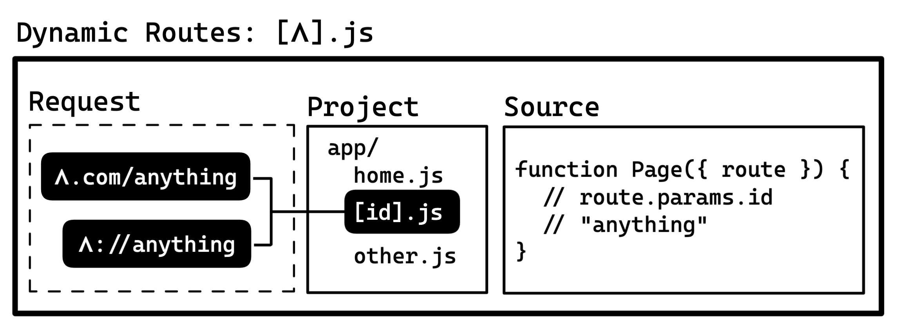
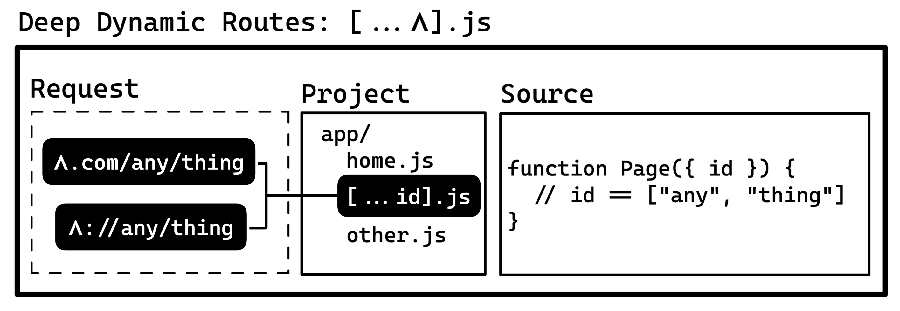

:::note Request for Comments

This convention is still a work-in-progress and subject to breaking changes! Please [contribute to the discussion](https://github.com/expo/router/discussions/1) if you have any ideas or suggestions on how we can improve the convention.

:::

The file system-based routing convention enables developers to structure their app in a logic and intuitive way. Expo router uses this convention to optimize the app by generating native deep links and web routes automatically.

The convention is based on the concept of nesting routes inside each other to create shared UI elements like tab bars and headers across multiple children. This format should feel familiar to React developers.

## App directory

The root level `app/` directory is used to define all routes and screens in the app.


<details>
  <summary>Interoperability</summary>

The app directory name could be customizable in the future, but that's not a priority as of now.

- The `app/` directory is similar to the:
- `app/routes/` directory in [Remix](https://remix.run/docs/en/v1/guides/routing#defining-routes).
- `pages/` directory in [Next.js](https://nextjs.org/docs/basic-features/pages).
- `src/routes/` directory in [SvelteKit](https://kit.svelte.dev/docs/routing).
- `app/` directory in the [Next.js layouts RFC](https://nextjs.org/blog/layouts-rfc#introducing-the-app-directory).

The entry file for classic Expo apps is `App.js`, the Expo config file is `app.json` (or `app.config.js`), and the Expo conference is called **App.js conf** so to keep things relatively consistent, the root directory is called `app/`. Luckily, most web frameworks are also using `app/` so it aligns well. This does mean you'll need a monorepo if you want to use Expo and another framework in the same repo.

</details>

# Routes

Routes are defined as files in the `app/` directory that export a React component as _default_. The file path is the route path.

```sh
app/
  index.js # Matches: 𝝠.com/
  home.js # Matches: 𝝠.com/home
  blog/posts.js # Matches: 𝝠.com/blog/posts
```

```tsx title=app/index.js
import { Text } from "react-native";

export default function Page() {
  return <Text>First page</Text>;
}
```

This renders to:

```xml
<App>
  <Index />
</App>
```

- You can use extensions: `js`, `tsx`, `ts`, `tsx`. In a future iteration we will add support for any extension in the Metro config [`resolver.sourceExts`](https://facebook.github.io/metro/docs/configuration#sourceexts).
- Any path in the `app/` directory can be used as a root path. There are no global root paths.
- Platform extensions like `.ios.js` or `.native.ts` are not currently supported in the `app/` directory.

## Layout Routes

To render shared navigation elements like a header, tab bar, or drawer, you can use a **layout route**.
If a **route** has a sibling directory by the same name, it will be used as the layout component for all the files in the respective directory.

```sh
app/
  stack.js # Layout route. This is where a header bar would go
  stack/ # Children of stack.js
    home.js # A child route of stack.js
```

If a nested route does not have a layout route then a virtual, unstyled navigator will be generated in-memory to accommodate the child route:

```sh
app/
  stack/ # Unpaired layout route
    home.js # Child route of a virtual navigator

  stack.tsx # This file exists in-memory to render the `stack/home.js` route. Creating this file will override the in-memory route
```

The virtual route system exists to accommodate native navigation which requires a parent navigator to render a child route.

<details>
  <summary>Interoperability</summary>

Nested routes are used to implement nested navigation in [React Navigation](https://reactnavigation.org/docs/nesting-navigators).

This convention is analogous to [nested routing](https://remix.run/docs/en/v1/guides/routing#what-is-nested-routing) (same format) in Remix.
Layout routes are also similar to `pages/_app.js` in Next.js.

</details>

## Fragment Routes


Fragment routes add nested layout without appending any path segments. Think of them like `index.js` but as a layout. These are most commonly used for adding navigators like tab, stack, drawer, etc... The format is `(name).js` and `/(name)`, the `name` is purely cosmetic and not provided to the route component.

```sh
app/
  layout.js # Layout route
  layout/
    home.js # 𝝠.com/layout/home

app/
  (layout).js # Fragment route
  (layout)/
    home.js # 𝝠.com/home
```

Both of these will render:

```xml
<App>
  <Layout>
    <Home />
  </Layout>
</App>
```

Be careful when using parallel fragment routes as they can create conflicting matches. For example, the following routes will conflict:

```sh
app/
  profile.js # Matches /profile
  (layout).js
  (layout)/
    profile.js # Matches /profile (conflict)
```

Expo router will assert when there are route collisions.

The name 'Fragment' route is a nod to [React Fragments](https://reactjs.org/docs/fragments.html) (`<>{...}</>`) which wrap components without adding any additional views to the hierarchy.

<details>
  <summary>Previous iteration</summary>

We originally considered using `index/` instead of `(index)/` since the leaf variation is automatically collapsed. This was rejected because `/index/index` was not a valid path for fragments but it was for leaf routes. Theoretically we should also be able to support multiple fragments in a single directory for swapping parent layouts.

</details>

<details>
  <summary>Interoperability</summary>

The Fragment convention is similar to:

- Groups in [SvelteKit](https://kit.svelte.dev/docs/advanced-routing#advanced-layouts-group) (`(group)`).
- [pathless layout routes](https://remix.run/docs/en/v1/guides/routing#pathless-layout-routes) in Remix (`__group`)
- [Route Groups](https://nextjs.org/blog/layouts-rfc#route-groups) in the upcoming Next.js layouts RFC (`(group)`).

</details>

## Index Routes

- If a route is named `./index.js`, it will add both `index` and `/` to the route, effectively acting as a [fragment route](#fragment-routes).
- Directories cannot be named `/index/`. The filename `/index.js` is reserved for [leaf routes](#leaf-routes).

<details>
  <summary>Interoperability</summary>

Index routes are based on the original `index.html` system from the Tim Berners-Lee/Apache HTTP Server days.

</details>

## Dynamic Routes



Dynamic routes match any unmatched path at a given segment level. For example, `/blog/[id]` is a dynamic route. The variable part (`[id]`) is called a "slug". Routes with higher specificity will be matched before a dynamic route. For example, `/blog/bacon` will match `blog/bacon.js` before `blog/[id].js`.

```
app/
  blog/
    [id].js # 𝝠.com/blog/123
```

The slug can be accessed as a prop in the route component:

:::danger Pending research

This convention is subject to breaking changes.

:::

```tsx title=app/blog/[id].js
export default function BlogPost({ id }) {
  return <Text>Blog post: {id}</Text>;
}
```

<details>
  <summary>Interoperability</summary>

> By [popular demand](https://twitter.com/Baconbrix/status/1567538444246589441), the dynamic routes pattern is based on the [Next.js dynamic routes](https://nextjs.org/docs/routing/dynamic-routes) system.

There are a couple different ways to implement dynamic routes, here are some existing formats:

| Format              | Framework |
| ------------------- | --------- |
| `/blog/[id].js`     | Next.js   |
| `/blog/[id].svelte` | SvelteKit |
| `/blog/$id.js`      | Remix     |

**Related**

- [Remix](https://remix.run/docs/en/v1/routing/file-system-routing)
- [`react-router`](https://reactrouter.com/web/guides/quick-start)
- [Next.js layouts RFC, pt. 1](https://nextjs.org/blog/layouts-rfc)

</details>

## Deep Dynamic Routes



Similar to dynamic routes, but the slug matches any number of unmatched path components in a route. For example, `/blog/[...id]` is a deep dynamic route where `[...id]` is the slug. `blog/[...ids].js` will match `/blog/1/2/3`.

:::danger Pending research

This convention is subject to breaking changes.

:::

Directory names can also be deep dynamic routes. For example, `/blog/[...id]/home.js` will match `/blog/1/2/3/home`.

<details>
  <summary>Interoperability</summary>

Deep dynamic routes are functionally analogous to the 'optional catch-all dynamic routes' (`[[...id]].js`) feature from Next.js but the syntax is the same as the 'required catch-all dynamic routes'. Unlike Next.js which has a separate syntax for matching everything except `/`, Expo uses the same syntax for both. If you want to match everything except index, you can add an `index.js` file that has custom handling or you could simply handle the slug differently. We also reserve the term **catch** for error handling.

The convention is also similar to splats in Remix.

</details>

## Glossary

- **Slug** A dynamic URL path segment.
- **Child route** A route that has no nested children, it shows up at the end of a URL.

## Next

- Add custom handling for unmatched routes (404): [guide](unmatched.md)
